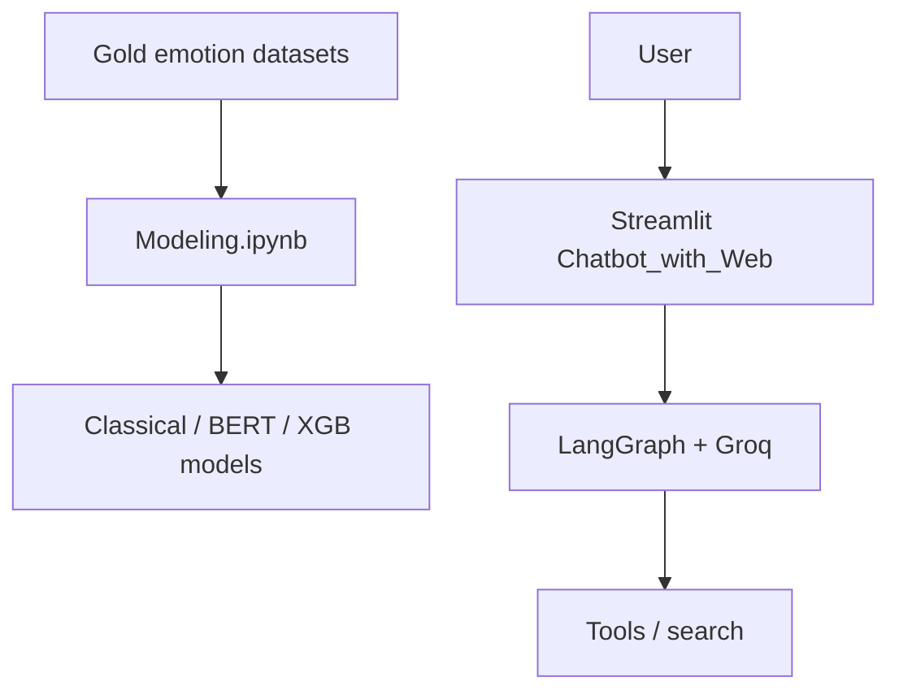
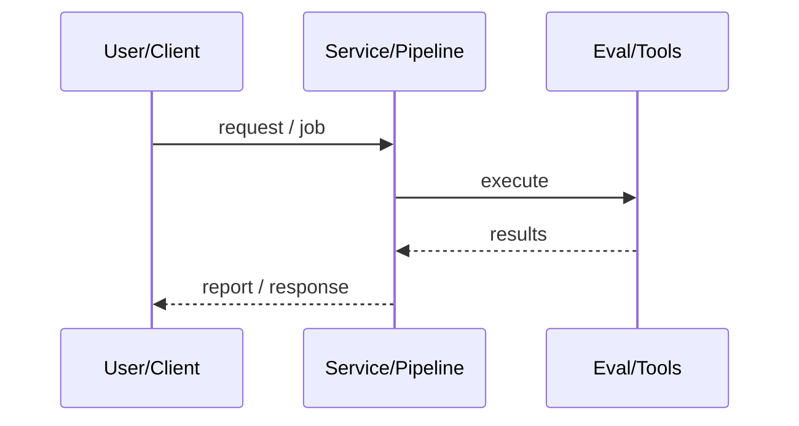
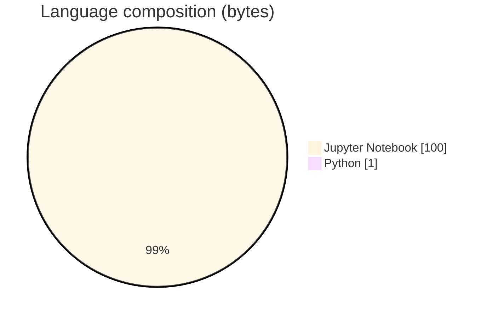

# EmotiCare AI Mental Health Assistant

### Multilabel GoEmotions-style modeling notebooks + LangGraph/Streamlit chatbot UI for supportive conversation and crisis-aware workflows.

[](https://github.com/ArchanaChetan07/EmotiCare_-AI-Powered-Mental-Health-Assistant)
[](https://github.com/ArchanaChetan07/EmotiCare_-AI-Powered-Mental-Health-Assistant)
[](https://github.com/ArchanaChetan07/EmotiCare_-AI-Powered-Mental-Health-Assistant)
[](https://github.com/ArchanaChetan07/EmotiCare_-AI-Powered-Mental-Health-Assistant/actions)

---

## Overview

Mental-health chat assistants need emotion understanding, distress-aware routing, and a usable UI—while avoiding overstated clinical accuracy.

Notebooks train TF-IDF classical models, DistilBERT pipelines, SBERT hybrids, and XGBoost-on-BERT embeddings for multilabel emotions; Chatbot_with_Web implements LangGraph nodes with Groq LLM + tools; top-level src/*.py currently empty placeholders.

Best classical Macro F1 ≈ 0.2921 (weighted Logistic Regression) on the notebook table; DistilBERT Top-2 pipeline Macro F1 0.2285; Streamlit LangGraph chatbot path for interactive use.

This repository is maintained as **production-minded portfolio work**: clear architecture, automated checks where present, and metrics that are **traceable to committed artifacts** (never invented).

---

## Architecture

Gold CSVs → cleaning notebooks → Modeling bakeoff → (parallel) LangGraph Streamlit chatbot using Groq





---

## Results & repository facts

> Only values found in code, configs, tests, or generated reports are listed. Absence of a clinical/ML accuracy number means it was **not** published in-repo.

| Metric | Value | Source |
|---|---|---|
| Best classical Macro F1 (LogReg weighted) | **0.2921** | `notebooks/Modeling.ipynb` |
| Best classical Micro F1 (LogReg weighted) | **0.3297** | `notebooks/Modeling.ipynb` |
| DistilBERT Top-2 pipeline Macro F1 | **0.2285** | `notebooks/Modeling.ipynb` |
| BERT+SBERT hybrid Macro F1 @0.65 threshold | **0.2565** | `notebooks/Modeling.ipynb` |
| Remorse F1 (best per-label table) | **0.5203** | `notebooks/Modeling.ipynb` |
| Fear F1 (best per-label table) | **0.3933** | `notebooks/Modeling.ipynb` |
| Tracked files | **90** | `git tree` |
| Python modules | **34** | `git tree` |
| Test-related paths | **2** | `git tree` |
| CI workflows | **Yes** | `.github/workflows` |
| Docker present | **No** | `repo root` |



---

## Key features

- Gold datasets for emotions/counseling text
- Multilabel emotion model bakeoff notebooks
- Distress-emotion per-label F1 comparison table
- LangGraph chatbot with tool node
- CI workflow

---

## Tech stack

| Layer | Technology |
|---|---|
| language | Python |
| nlp | TF-IDF / DistilBERT / SBERT |
| agent | LangGraph |
| llm | Groq |
| ui | Streamlit |
| data | GoEmotions / CounselChat / Facebook gold CSVs |

---

## Skills demonstrated

Jupyter Notebook · scikit-learn · Transformers / DistilBERT · Sentence-Transformers · XGBoost · LangGraph · Streamlit · CI/CD · testing · automation

Keyword surface: **Python · Jupyter Notebook · machine-learning · CI/CD · testing · API · Docker · automation · data-science · software-engineering · system-design · observability · LLM · cloud**

---

## Project structure

```text
EmotiCare_-AI-Powered-Mental-Health-Assistant/
├── notebooks/Modeling.ipynb
├── Data/*_gold.csv
├── Chatbot_with_Web/ (LangGraph + Streamlit)
├── src/  (empty stubs)
└── app/  (empty stubs)
```

---

## Installation & usage

```bash
git clone https://github.com/ArchanaChetan07/EmotiCare_-AI-Powered-Mental-Health-Assistant.git
cd EmotiCare_-AI-Powered-Mental-Health-Assistant/Chatbot_with_Web
pip install -r requirements.txt
streamlit run app.py
```

---

## How it works

Research notebooks evaluate multilabel emotion classifiers on gold datasets; the shipping interactive path is the LangGraph Streamlit app that chats via Groq and optional tools. Empty `src/` modules are placeholders.

---

## Future improvements

- Populate empty src/app modules or remove them
- Wire crisis_detector with evaluated thresholds from notebooks
- Scratch non-reproducible README claims (87.3% acc / 91.2% crisis P/R / 4.1 empathy / <120ms)—not found in artifacts

---

## License

See repository.

---

<p align="center">
  <b>EmotiCare AI Mental Health Assistant</b><br/>
  <a href="https://github.com/ArchanaChetan07/EmotiCare_-AI-Powered-Mental-Health-Assistant">github.com/ArchanaChetan07/EmotiCare_-AI-Powered-Mental-Health-Assistant</a>
</p>
