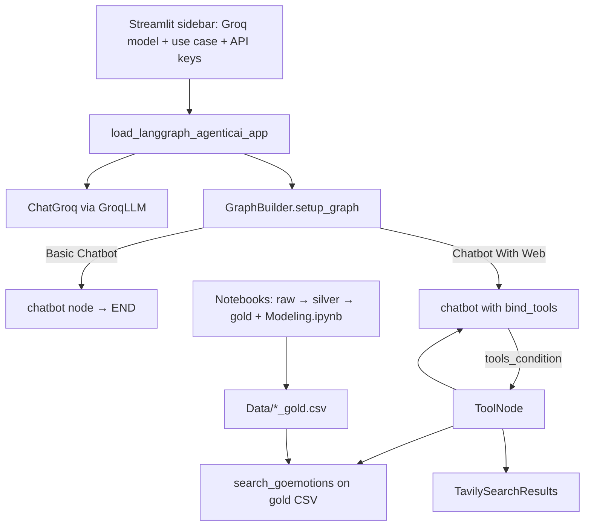

# EmotiCare — AI-Powered Mental Health Assistant

### LangGraph chatbot + gold emotion corpora + notebook modeling

[](https://github.com/ArchanaChetan07/EmotiCare_-AI-Powered-Mental-Health-Assistant/actions/workflows/ci.yml)
[](https://www.python.org/)
[](Chatbot_with_Web/app.py)
[](Chatbot_with_Web/src/langgraphagenticai/graph/graph_builder.py)

Streamlit app that wires a **Groq** LLM into a **LangGraph** state machine: basic chat, or a tool-enabled path that can search a local **GoEmotions** gold table and call **Tavily** web search. Companion notebooks clean raw corpora into gold CSVs and benchmark multi-label emotion classifiers (TF–IDF + classical models, DistilBERT experiments).

---

## Key Results

| Metric | Value | Source |
|---|---|---|
| Gold rows — GoEmotions | **57,732** | `Data/goemotions_gold.csv` |
| Gold rows — Facebook emotion posts | **129,264** | `Data/facebook_gold.csv` |
| Gold rows — CounselChat | **4,603** | `Data/counselchat_gold.csv` |
| Best notebook Macro F1 (GoEmotions multi-label) | **0.3133** @ threshold 0.65 | `notebooks/Modeling.ipynb` (weighted LogReg) |
| Matching Micro F1 / Hamming | **0.3487** / **0.0642** | same notebook cell |
| Strong classical baseline (weighted LogReg, default) | Macro F1 **0.2921** | same notebook comparison table |
| Chat use cases | Basic Chatbot · Chatbot With Web | `uiconfigfile.ini` |
| Agent tools | `search_goemotions` + Tavily (`max_results=2`) | `tools/search_tool.py` |
| Unit tests | **8** keyword/smoke cases | `tests/test_emoticare__ai_powered_men.py` |
| Notebooks | **7** (clean → gold → EDA → modeling) | `notebooks/` |

> Crisis / empathy headline numbers that previously appeared in the templated README are **not** reproduced here — they are not present in committed evaluation outputs. Prefer the notebook tables above.

---

## Architecture



**How it works:** the Streamlit entrypoint builds a LangGraph for the selected use case, streams or invokes the graph on the chat message, and renders human / tool / AI messages. Modeling notebooks are offline research; the live app retrieves emotion examples from gold data via a LangChain `@tool`, not a hosted classifier service.

---

## Tech Stack

| Layer | Choice |
|---|---|
| App UI | Streamlit |
| Agent graph | LangGraph + LangChain |
| LLM | Groq (`llama3-8b-8192`, `llama3-70b-8192`, `gemma2-9b-it`) |
| Web search | Tavily |
| Local emotion retrieval | pandas over `goemotions_gold.csv` |
| Modeling (notebooks) | scikit-learn, DistilBERT / SBERT experiments |
| CI | GitHub Actions: flake8 (non-blocking) + pytest |

`faiss-cpu` appears in `requirements.txt` but is **not imported** by the current Streamlit/LangGraph path.

---

## Features

- Two LangGraph topologies: single-node chat vs tool loop with conditional edges
- Sidebar config for LLM / model / use case and API keys
- Gold triple-corpus under `Data/` (mirrored in `Chatbot_with_Web/Data_final/`)
- Keyword-oriented pytest suite for emotion / crisis token checks (scaffolding, not model eval)
- Exploratory + modeling notebooks for multi-label GoEmotions baselines

**Note:** top-level `src/*.py` and `app/*.py` stubs from `create_emoticare_structure.py` are empty placeholders; the working product lives under `Chatbot_with_Web/`.

---

## Installation & Usage

```bash
git clone https://github.com/ArchanaChetan07/EmotiCare_-AI-Powered-Mental-Health-Assistant.git
cd EmotiCare_-AI-Powered-Mental-Health-Assistant

python -m venv .venv
# Windows: .venv\Scripts\activate
source .venv/bin/activate

pip install -r Chatbot_with_Web/requirements.txt
# or: pip install -r requirements.txt
```

```bash
cd Chatbot_with_Web
streamlit run app.py
```

Supply a **GROQ_API_KEY** in the sidebar. For **Chatbot With Web**, also set a **TAVILY_API_KEY**.

```bash
# from repo root
pytest tests/test_emoticare__ai_powered_men.py -q
```

---

## Project Structure

```text
EmotiCare_-AI-Powered-Mental-Health-Assistant/
├── Chatbot_with_Web/
│   ├── app.py                          # streamlit entry → main.load_langgraph_agenticai_app
│   ├── Data_final/                     # gold CSV mirror used by tools
│   ├── requirements.txt
│   └── src/langgraphagenticai/
│       ├── main.py                     # UI → Groq → GraphBuilder → display
│       ├── graph/graph_builder.py      # Basic vs tools graphs
│       ├── nodes/                      # chatbot nodes
│       ├── tools/search_tool.py        # GoEmotions search + Tavily
│       ├── tools/data_loader.py
│       ├── LLMS/groqllm.py
│       └── ui/streamlitui/             # sidebar + result rendering
├── Data/                               # counselchat / facebook / goemotions gold
├── notebooks/                          # cleaning, EDA, Modeling.ipynb
├── tests/test_emoticare__ai_powered_men.py
└── .github/workflows/ci.yml
```

---

## Future Improvements

- Wire a trained multi-label classifier into the graph (replace keyword / CSV peek tools)
- Drop unused empty `src/` / `app/` stubs or implement crisis journaling flows
- Tighten CI: install real deps and assert graph compile under mocked LLM/tools
- Remove unused `faiss-cpu` or add a real vector RAG path if retrieval is needed

---

## License

See repository license file if present.
